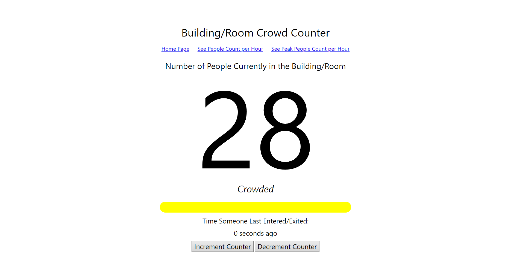
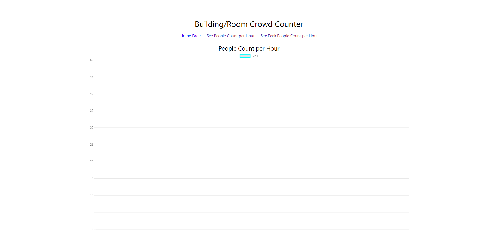

# Crowd Counter with NodeJS

A WoT Project for Raspberry Pi

## Members

Armocilla, John Mar Y.

Del Rosario, Vance

Reyes, Justin Rupert F.

Rudico, Ericka F. 

## Contributions
### Armocilla
- Coded the Data Charts and functionalities in the Application

### Del Rosario
- Coded the application server using NodeJS, ExpressJS, and Socket.IO

### Reyes
- Developed the hardware to integrate with the application

### Rudico
- Developed the data storage of the application for the charts

## Pre-req
1. Node installed
2. Visual Studio Code

## Running the Codes
0. Open Terminal with 
```
ctrl + `
```
1. Clone the github repository with 
```
git clone https://github.com/VanceDR/CPE124-Project-Repository
```
2. Go to the folder by 
```
cd CPE124-Project-Repository
```
3. Install packages needed using 
```
npm install
```
4. Run the app using 
```
npm start
```
5. Open the App in browser with
```
localhost:8484
```


## Implemented
1. Counter
2. Real-Time updated with Socket.io
3. Charts with Charts.js
4. Functioning Updates from counter to graphs
5. Data storage using JSON

## To-Do
1. Integration of the PIR Sensor to Control the increment and decrement of the values in the webapp

## Screenshots



